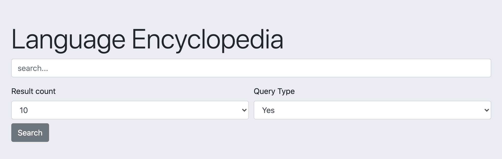

# Language Search Using Whoosh

language_whoosh.py uses whoosh to search a language dictionary on the web.

## Installation

Below are required packages, [pip] to install:

'''bash
pip install Flask
pip intall Whoosh
'''

## Usage

Navigate to page presented by the terminal; typically http://127.0.0.1:5000/
Indexed data can be found in index/languages_spoken.csv

'''bash
./language_whoosh.py
-- or --
python3 language_whoosh.py
'''